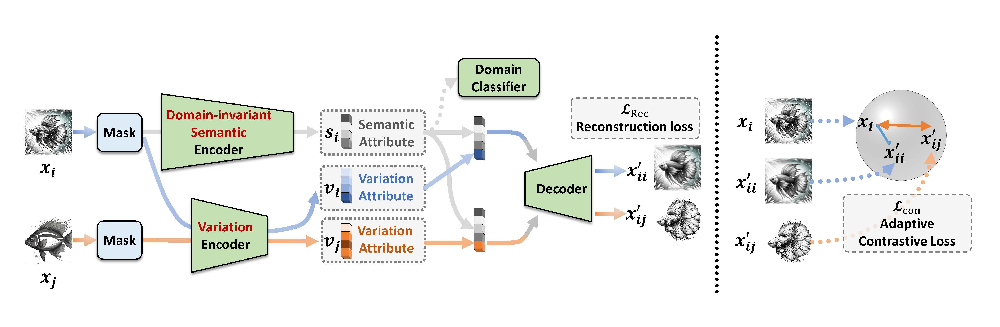

# Disentangling Masked Autoencoders for Unsupervised Domain Generalization

This is the source code accompanying the paper Disentangling Masked Autoencoders for Unsupervised Domain Generalization by An Zhang*, Han Wang*, Xiang Wang, Tat-Seng Chua \
(\* denotes equal contribution)



## Dataset Preparation

### DomainNet

+ Please download [DomainNet](https://ai.bu.edu/M3SDA/) and place the data in the `./dataset`
+ Run the following command to split the dataset for the unsupervised domain generalization setting
    ```bash
    cd ./dataset
    ./split.sh
    ```

## Training

See the demos in `./script/`.

### Pretraining

Please run the following command to pretrain the model on the painting, real, and sketch domains:
```bash
python ../train.py \
    --dataset DomainNet \
    --test_envs 0 1 3 \
    --batch_size 96 \
    --mask_ratio 0.80 \
    --lr 1e-4 \
    --epochs 501 \
    --lambda1 1e-3 \
    --lambda2 0.0 \
    --is_linear \
    --augment
```
Replace `--test_envs 0 1 3` with `--test_envs 2 4 5` to pretrain on the clipart, infograph, quickdraw domains.

### Finetuning

Please run the following command to finetune pretrained model with label fraction 100\%:
```bash
python ../train_finetune.py \
    --test_envs 0 1 3 \
    --dataset DomainNet \
    --batch_size 12 \
    --lr 5e-5 \
    --val_fraction 1.00 \
    --holdout_fraction 0.10 \
    --epochs 51 \
    --resume /path/to/checkpoints \
    --augment
```
Modify `val_fraction` and `holdout_fraction` to set different label fractions. Detailed information can be found in `train_finetune.py` function `get_args_parser()`.

## Citation

If you find our code useful, please consider citing:

```
@article{zhang2024disentangling,
  title={Disentangling Masked Autoencoders for Unsupervised Domain Generalization},
  author={Zhang, An and Wang, Han and Wang, Xiang and Chua, Tat-Seng},
  journal={arXiv preprint arXiv:2407.07544},
  year={2024}
}
```